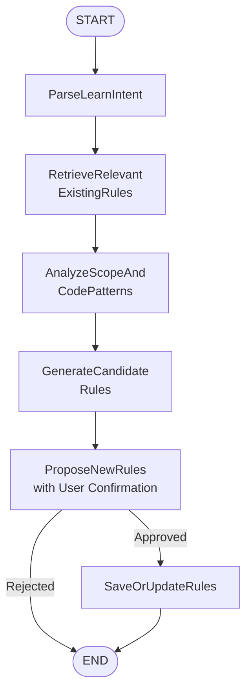
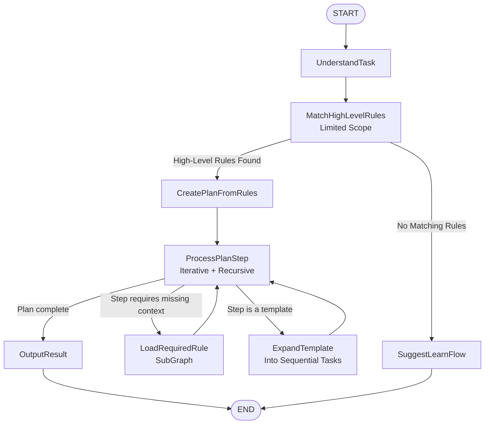
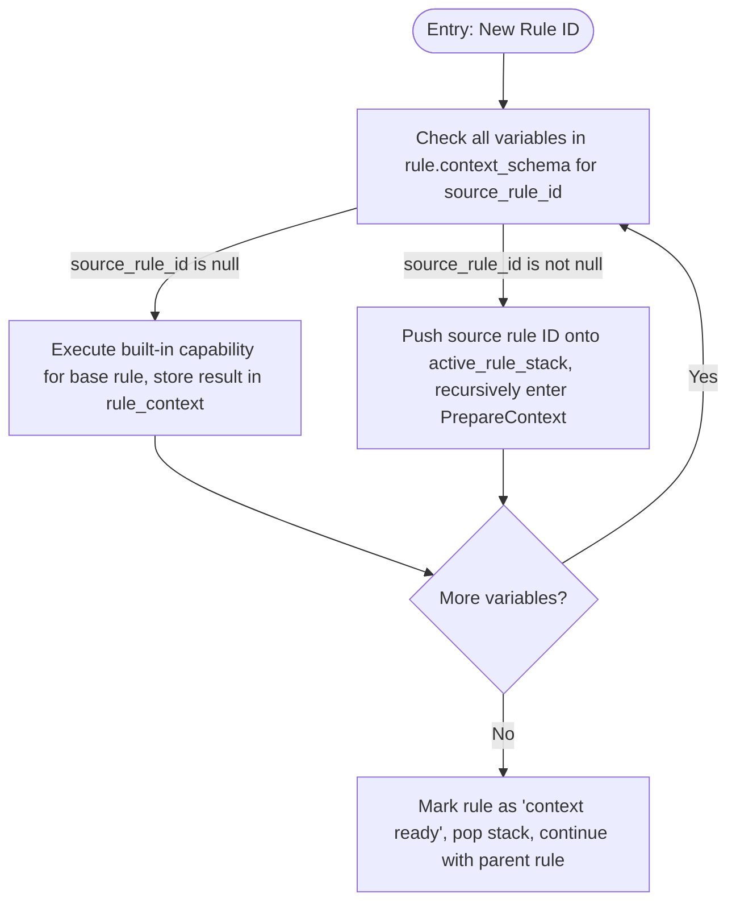
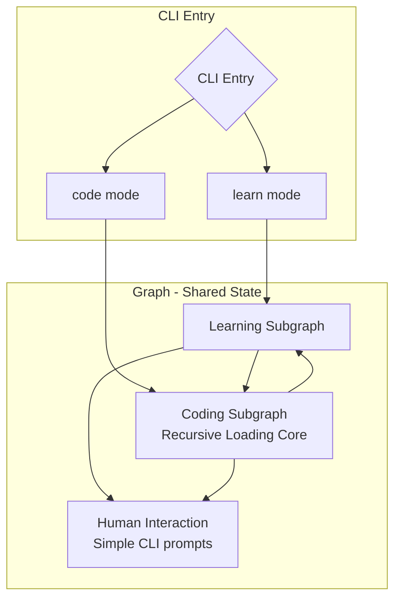

## I. Overall Architecture: Single State Machine, Dual-Entry Mode

Instead of two separate graphs, we design a **unified state machine** that enters different subgraph branches based on the `mode` parameter passed via CLI (`learn` / `code`).

**The shared global state object roughly includes:**

```typescript
interface AgentState {
  mode: 'learn' | 'code'; // Workflow mode
  userInput: string; // Raw user input (prompt for learning or task description for coding)
  scope: string | null; // Scope limitation for learning (file, directory, concept domain)
  projectRoot: string; // Current working directory

  // Rule engine related
  triggeredRules: number[]; // List of rule IDs triggered by this task
  activeRuleStack: number[]; // Current rule stack being processed (for recursive dependencies)
  ruleContext: Record<string, any>; // Retrieved context variables {varName: value}
  missingContext: string[]; // Names of context variables not yet satisfied

  // Interaction and output
  messages: Message[]; // Conversation history with user (for mid-way confirmations)
  finalResult: string | null; // Output of the coding flow (diff or generated file content)
  pendingConfirmation: object | null; // Conflict/modification proposal requiring user confirmation

  // Coding flow specific (MVP: sequential execution plan)
  executionPlan: ExecutionStep[] | null; // Structured plan generated by CreatePlanFromRules
  planStepQueue: ExecutionStep[];        // Remaining steps to be processed
}
```

---

## II. Learning Flow (Learn Flow) Detailed

### Trigger Method

CLI command similar to:

```bash
tool learn --scope src/domain/order --message "Learn the directory conventions for DDD aggregates"
```

Or omit `--scope`, letting the AI infer the scope from the message.

### Nodes and Flow Diagram (MVP Simplified)



### Node Details

| Node                                  | Responsibilities                                                                                                                                                                                                                                                                                                                                                                                                                                               |
| :------------------------------------ | :------------------------------------------------------------------------------------------------------------------------------------------------------------------------------------------------------------------------------------------------------------------------------------------------------------------------------------------------------------------------------------------------------------------------------------------------------------- |
| `ParseLearnIntent`                    | Use LLM to extract from `userInput`: 1) Candidate rule name; 2) Draft rule description; 3) Possible keyword tags; 4) Implied trigger conditions.                                                                                                                                                                                                                                                                                                               |
| `RetrieveRelevantExistingRules`       | Use extracted keywords to query the database `rules` table (full-text search on `tags` and `name`), returning a list of potentially existing relevant rules. **In MVP, this is only used to inform the user about possible duplicates; no automatic refactoring is performed.**                                                                                                                                                                                |
| `AnalyzeScopeAndCodePatterns`         | Read file contents under `scope`, use **lightweight AST parsing or regex** to capture patterns that can be standardized (e.g., consistent use of `@Injectable()`, unified error handling). This step is independent of existing rules.                                                                                                                                                                                                                         |
| `GenerateCandidateRules`              | Combine learning objectives and code patterns, let LLM generate candidate rules in JSON format according to the `rules` table structure. Emphasize making `triggerCondition` specific (e.g., `{"fileType": "dto"}`).                                                                                                                                                                                                                                           |
| `ProposeNewRules`                     | Show a preview of the candidate rule(s) to the user. If similar existing rules were found during retrieval, the prompt will mention them as a hint (e.g., "Rule #123 seems related. Consider reviewing it."), but **no automated merging or refactoring** is attempted. The user simply approves (Y/n) to save the new rule.                                                                                                                                    |
| `SaveOrUpdateRules`                   | Execute database write, simultaneously parse `description.refs` and `contextSchema.sourceRuleId`, populate `ruleReferences` table.                                                                                                                                                                                                                                                                                                                             |

*Note: The complex `AnalyzeRuleRelationshipsAndRefactor` and `RefactorRules` nodes are omitted for MVP simplicity. The user retains full control over rule evolution.*

---

## III. Coding Flow (Code Flow) Detailed

### Trigger Method

```bash
tool code "Implement all application services defined in the DOMAIN.md specification following DDD and NestJS DI conventions"
```

### Core Design Principles for the Coding Flow

1. **Minimal Initial Rule Expansion** – After task understanding, only a small, high‑level set of rules is matched. The graph avoids eagerly loading all potentially relevant rules.
2. **Plan‑First Approach** – Once high‑level rules are identified, the agent creates a **structured execution plan** that may contain **sequential template tasks**.
3. **Just‑In‑Time Rule Retrieval** – When the plan encounters a step that cannot be executed with the current `ruleContext`, the agent recursively loads the specific rule(s) needed for that sub‑task. **This recursive loading is the core MVP feature.**
4. **Sequential Execution** – For MVP, tasks generated from templates are processed sequentially (one after another) to keep state management simple and deterministic.

### Nodes and Flow Diagram



### Detailed Node Descriptions

| Node                              | Responsibilities                                                                                                                                                                                                                                                                                                                                                                                                                                                                                 |
| :-------------------------------- | :----------------------------------------------------------------------------------------------------------------------------------------------------------------------------------------------------------------------------------------------------------------------------------------------------------------------------------------------------------------------------------------------------------------------------------------------------------------------------------------------- |
| `UnderstandTask`                  | Parse the user's natural language task into a structured intent object containing: desired outcome, affected domain entities, and any explicit references to files or specifications.                                                                                                                                                                                                                                                                                                            |
| `MatchHighLevelRules`             | Query the rule database **with a strict limit** (e.g., top 3‑5 rules). Only retrieve **architectural**, **workflow**, or **meta‑rules** that describe _how_ to approach the task (e.g., “Domain Specification Parsing Rule”, “NestJS Application Service Implementation Workflow”, “DDD Module Structure Rule”). The goal is to obtain a skeleton for planning, not to fetch every possible implementation detail.                                                                               |
| `CreatePlanFromRules`             | Using the matched high‑level rules, generate a **multi‑level execution plan**. The plan may include: <br/>• **Sequential steps** (e.g., “First, parse DOMAIN.md to extract all application service signatures.”)<br/>• **Template tasks** for repetitive work (e.g., “For each extracted service signature, apply the ‘Implement Single Application Service’ template.”). In MVP, template tasks are **expanded into sequential sub‑steps** without parallelism.                                 |
| `ProcessPlanStep`                 | The central execution loop. It maintains a queue of plan steps. For each step:<br/>1. Check if the current `ruleContext` and loaded rules provide enough information to execute the step.<br/>2. **If sufficient**, execute the step (e.g., generate code for one service) and store the result.<br/>3. **If insufficient**, trigger the `LoadRequiredRule` sub‑graph to fetch the precise rule needed (e.g., “NestJS Dependency Injection Decorators”), then re‑evaluate the step.              |
| `LoadRequiredRule`                | **Core recursive sub‑graph** that:<br/>• Identifies the exact rule ID required for the missing capability.<br/>• If the rule is already in `activeRuleStack`, raises a circular dependency error.<br/>• Otherwise, pushes the rule ID onto the stack, runs its `PrepareContext` (which may recursively load its own dependencies), and finally merges its capabilities into `ruleContext`.<br/>This ensures rules are loaded **on‑demand** and only when absolutely necessary, preserving short‑context accuracy. |
| `ExpandTemplateIntoSequentialTasks` | When a plan step defines a template (e.g., `template: "ImplementSingleApplicationService"` with parameters `[{serviceName: 'OrderService'}, {serviceName: 'CustomerService'}]`), this node **creates individual sequential sub‑tasks** and pushes them onto the `planStepQueue`. Each sub‑task follows the same `ProcessPlanStep` logic, recursively loading rules as needed. **MVP explicitly avoids parallel execution** to reduce state management complexity.                                  |
| `OutputResult`                    | Aggregate all generated files and changes, format them as a unified diff or file tree, and present the final result to the user. A **lightweight LLM self‑review warning** may be appended if potential compliance issues are detected, but no automatic correction loop is performed.                                                                                                                                                                                                            |

### Recursive Context Preparation Subgraph (Inside PrepareContext)

This is an important sub-process that implements the core "short-sighted recursive retrieval" concept from your design.



**Preventing circular dependencies**: Before recursion, check `active_rule_stack`. If a cycle is detected, interrupt and prompt the user to fix the rule dependency.

### Illustrative Example of the New Flow

**Task:** “Implement all application services from DOMAIN.md using NestJS DI.”

1. **MatchHighLevelRules** returns:

- Rule #42: “Parse DOMAIN.md Application Service Table”
- Rule #101: “NestJS Application Service Implementation Workflow”
- Rule #15: “DDD Module Directory Structure”

2. **CreatePlanFromRules** produces the following plan:

   ```json
   {
     "steps": [
       {
         "id": "parseDomainDoc",
         "description": "Extract service signatures from DOMAIN.md",
         "ruleRequired": 42,
         "action": "readAndParse"
       },
       {
         "id": "implementServices",
         "description": "Generate NestJS classes for each signature",
         "template": {
           "templateRuleId": 101,
           "itemsFromContext": "parsedServices"
         }
       }
     ]
   }
   ```

3. **ProcessPlanStep** executes `parseDomainDoc` using Rule #42 (already loaded). It stores the list of service signatures in `ruleContext.parsedServices`.

4. Next step is a template. `ExpandTemplateIntoSequentialTasks` creates **one sequential sub‑task per signature** and queues them.

5. For the first sub‑task (“OrderService”), `ProcessPlanStep` checks Rule #101. Rule #101 states: _“An application service must be decorated with `@Injectable()` and placed in `src/modules/<module>/application/`.”_ However, Rule #101 does **not** specify _how_ to write the `@Injectable()` decorator—it references Rule #201: “NestJS DI Decorator Usage”.

6. The agent detects missing context for `@Injectable()` and invokes `LoadRequiredRule` for Rule #201. Rule #201 is loaded **recursively**; its context is prepared (maybe it just provides a static code snippet), and then the sub‑task completes.

7. Because Rule #201 is now cached in `ruleContext`, all subsequent sequential service implementations reuse it without further loading.

8. After all services are generated, the agent proceeds directly to `OutputResult`. A final LLM review may note any directory mismatches, but no automatic re‑work is performed.

### Integration with the Learning Flow

If during `MatchHighLevelRules` **no** suitable rule is found, the flow transitions to the learning flow as before. However, the new design also allows for **in‑flight rule learning**:

- While executing `ProcessPlanStep`, if a step cannot be completed because _no rule exists_ for a required capability (e.g., “How to handle transactional decorators in this project”), the agent can **pause** the coding flow and invoke the learning flow to generate a candidate rule. Once the user approves the new rule, the coding flow resumes exactly where it left off.

This creates a seamless bidirectional relationship between the two sub‑graphs.

### Updated State Fields for the New Coding Flow

| State Field           | Purpose in New Flow                                                                                                                                                           |
| :-------------------- | :---------------------------------------------------------------------------------------------------------------------------------------------------------------------------- |
| `triggeredRules`      | Now stores only **high‑level** rules initially. Additional rules loaded on‑demand are appended to this list.                                                                  |
| `activeRuleStack`     | Used to prevent circular dependencies during recursive `LoadRequiredRule` calls.                                                                                              |
| `ruleContext`         | Holds all data extracted or generated during plan execution, including the results of template expansions.                                                                    |
| `missingContext`      | Used internally within `ProcessPlanStep` to determine when to invoke `LoadRequiredRule`.                                                                                      |
| `pendingConfirmation` | Set when the agent needs to propose a **new rule** during coding, or when a simple conflict requires user choice (e.g., “Rule already exists; overwrite?”).                   |
| `executionPlan`       | Stores the structured plan object generated by `CreatePlanFromRules`.                                                                                                         |
| `planStepQueue`       | A queue of remaining steps (including dynamically generated sequential template tasks) to be processed.                                                                       |

---

## IV. Intersection of the Two Flows: Discovering Missing Rules During Coding

If at the `MatchTriggerRules` step of the coding flow, no rule matches the current task, or during `PrepareContext` a rule corresponding to a `sourceRuleId` is not found (dirty data situation), trigger a **subgraph transition**:

1. Pause the current coding flow.
2. Package the description of the currently missing context or task intent as a parameter to **start the learning flow** (directly entering the `GenerateCandidateRules` node, skipping some earlier nodes).
3. After the learning flow completes, **resume the coding flow**, restarting from `PrepareContext`.

In LangGraph, this can be achieved through **nested graphs** or **conditional edges that suspend and send a human intervention request**.

---

## V. State Management Key Points

| State Field           | Write Operation Nodes                                                     | Read Operation Nodes                             |
| :-------------------- | :------------------------------------------------------------------------ | :----------------------------------------------- |
| `triggeredRules`      | `MatchTriggerRules`                                                       | `PrepareContext`, `ExecuteCodeAction`            |
| `ruleContext`         | `PrepareContext` (added each recursion)                                   | `ExecuteCodeAction` (used for filling templates) |
| `missingContext`      | `PrepareContext` (calculated at initialization)                           | Recursive control loop                           |
| `pendingConfirmation` | `ProposeNewRules` (and any interactive prompt)                             | Frontend polling or LangGraph interrupt point    |
| `messages`            | All interactive nodes                                                     | Frontend display                                 |

---

## VI. Edge Cases and Exception Handling Strategies

| Scenario                                                                       | Handling Strategy                                                                                                                                   |
| :----------------------------------------------------------------------------- | :-------------------------------------------------------------------------------------------------------------------------------------------------- |
| A rule dependency `sourceRuleId` points to a disabled rule                     | In `PrepareContext`, detect `isActive=false`, prompt user and abort, or suggest an alternative rule.                                                |
| User refuses to save new rules in the learning flow                            | End directly, do not modify the database.                                                                                                           |
| User requests to modify rules after code is generated in coding flow           | Can transition to the learning flow from the current coding session via a special command, pre-filling the rule content.                            |
| Multiple rules have overlapping trigger conditions but non-conflicting content | Apply all, merge constraints. If there is a contradiction (e.g., one requires `any`, one forbids it), **prompt the user for resolution** (MVP: simple CLI choice, not automatic arbitration). |

---

## VII. Adaptation for CLI Interaction (MVP Simplification)

Since the tool is positioned as a CLI, interaction with the user (confirmation, conflict resolution) will be **synchronous** in the MVP.

- The CLI will use standard input/output libraries (e.g., Node.js `readline`, `inquirer`) to **block** the graph execution and wait for user response.
- **LangGraph interrupt persistence is NOT used** in the MVP to avoid complex state serialization. If the user aborts (Ctrl+C), the session is lost and must be restarted.
- This keeps the implementation simple and focused on the core rule retrieval logic.

---

## VIII. Final Workflow System Overview

