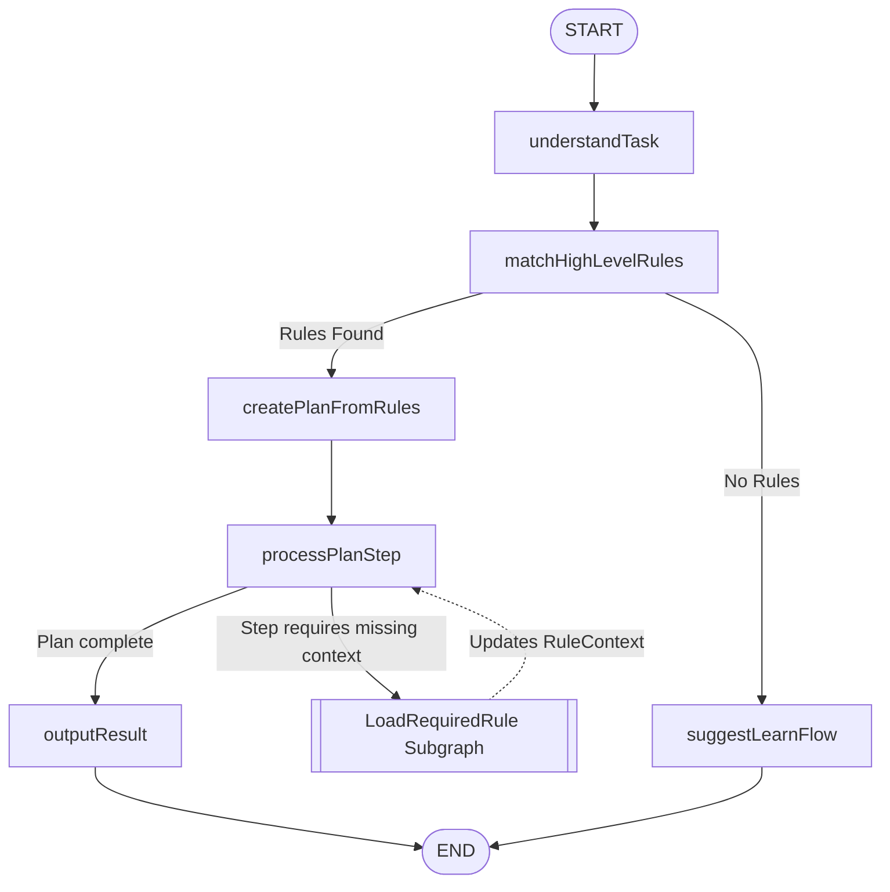

# Coding Flow Specification

## Overview

The Coding Flow translates a high‑level natural language task into a concrete implementation plan and executes it recursively, loading rules **just‑in‑time** to keep the context short and precise.

---

## State

The flow maintains internal state defined by `CodingStateSchema`. Key conceptual fields:

| Field                   | Purpose                                                            |
| ----------------------- | ------------------------------------------------------------------ |
| `userInput`             | Raw coding task prompt from the user.                              |
| `projectRoot`           | Absolute path anchoring all file operations.                       |
| `taskIntent`            | Structured intent extracted from the user input (nullable).        |
| `triggeredRules`        | Rule IDs triggered by the intent.                                  |
| `matchedHighLevelRules` | Full rule objects for the high‑level architectural rules.          |
| `activeRuleStack`       | Stack of rule IDs currently being processed (for cycle detection). |
| `ruleContext`           | Shared context containing rule outputs and loaded rule cache.      |
| `executionPlan`         | Tree of `ExecutionStep` objects (nullable, set after planning).    |
| `finalResult`           | Aggregated output presented to the user (nullable).                |

The `RuleContext` object inside the state consists of:

- `ruleOutputs`: `Map<number, Record<string, any>>` – outputs produced by each executed rule.
- `loadedRules`: `Map<number, Rule>` – cache of fully loaded rule objects.

The `ExecutionStep` structure represents a node in the plan tree:

```typescript
{
  id: string;
  description: string;
  rulesRequired: number[];
  subSteps: ExecutionStep[] | null;
  status: 'pending' | 'inProgress' | 'completed' | 'failed';
  output?: string;
}
```

_Complete and authoritative definitions reside in the Zod schemas._

---

## Nodes & Responsibilities

The main graph consists of six nodes. Each node performs a discrete task and updates the state partially. All node implementations currently throw `Not implemented` and serve as placeholders for future development.

### `understandTask`

Parses `userInput` into a structured `taskIntent` containing `desiredOutcome`, `affectedEntities`, and optional `fileReferences`.  
**Dependencies:** `llm.complete` _(to be implemented)_

### `matchHighLevelRules`

Queries the rule repository using the `taskIntent` to find high‑level rules (tagged `architectural`, `workflow`, or `meta`). Populates `triggeredRules` and `matchedHighLevelRules`.  
**Dependencies:** `ruleRepository.findMatchingRules` _(to be implemented)_

### `createPlanFromRules`

Synthesizes the high‑level rules and the task intent into an `executionPlan` tree. Each step includes the IDs of the rules that directly guide it.  
**Dependencies:** `llm.complete` _(to be implemented)_

### `processPlanStep`

Depth‑first executor that traverses the `executionPlan`. For each step, ensures all `rulesRequired` are loaded. If a required rule is missing, it delegates to the **`LoadRequiredRule` Subgraph** (a self‑contained module). Once context is complete, the step’s action is performed.  
**Dependencies:** `ruleLoader.loadRule` (subgraph interface), step action handlers _(to be implemented)_

### `suggestLearnFlow`

Fallback node invoked when no high‑level rules match. Transitions control to the Learning Subgraph to capture new conventions.  
**Dependencies:** none (routing only) _(to be implemented)_

### `outputResult`

Aggregates all generated artifacts from the executed plan steps and presents the final diff / file tree to the user. May include a lightweight self‑review.  
**Dependencies:** file aggregation utilities _(to be implemented)_

---

## Subgraph: `LoadRequiredRule` (Black‑Box Module)

This is the **core recursive retrieval engine**. It operates as a separate state machine with its own internal state, exposing only a simple interface to the main flow. Its implementation is fully encapsulated and tested in isolation.

### Interface

```typescript
interface LoadRuleSubgraph {
  /**
   * Loads a single rule and recursively prepares its context.
   * @throws CircularDependencyError if a cycle is detected.
   * @returns A promise that resolves when the rule and all its dependencies are loaded.
   */
  loadRule(ruleId: number, globalContext: RuleContext): Promise<void>;
}
```

### Internal Behavior (Conceptual)

1. Check if `ruleId` is already in `globalContext.loadedRules`. If so, return immediately.
2. Detect circular dependencies using a private `preparationStack`.
3. Fetch the full `Rule` object from the database.
4. For each required input defined in the rule’s `context` field:

- If `sourceRuleId === null`, invoke a built‑in capability.
- Otherwise, recursively call `loadRule(sourceRuleId)`.

5. Store the prepared outputs in `globalContext.ruleOutputs`.
6. Mark the rule as loaded in `globalContext.loadedRules`.

The subgraph is **self‑contained**; the main flow only interacts with the `loadRule` method and the shared `RuleContext`.

---

## Execution Flow

The main graph executes linearly, with a conditional branch when no high‑level rules are found, and a delegation to the `LoadRequiredRule` subgraph during plan processing.



The routing logic is implemented in the `buildCodingGraph` function via conditional edges.

---

## Dependencies

The host environment must inject the following services. Precise function signatures are defined in the `CodingContextSchema` (to be implemented alongside the nodes).

| Service          | Purpose                                                |
| ---------------- | ------------------------------------------------------ |
| `llm`            | Raw LLM invocation; subgraph handles response parsing. |
| `ruleRepository` | Rule database access (query, fetch by ID).             |
| `ruleLoader`     | The `LoadRequiredRule` subgraph instance.              |
| `fileSystem`     | Filesystem access scoped to `projectRoot`.             |

_The dependency injection contract will be finalized when the node implementations are completed._
