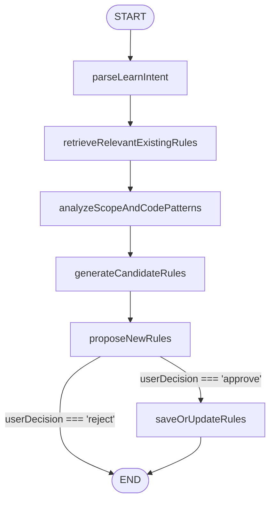

# Learning Subgraph

## Overview

The Learning Subgraph transforms natural language learning requests (e.g., _"Learn the DDD aggregate conventions in this module"_) into persisted, referenceable rules.

The subgraph is implemented as a self-contained `StateGraph` whose state and dependencies are strictly defined by Zod schemas in the codebase. This document describes the subgraph's _behavior and integration contract_; for precise type definitions, refer to:

- **State schema:** `learning.state.ts` (`LearningStateSchema`)
- **Dependency schema:** `learning.context.ts` (`LearningContextSchema`)

---

## State

The subgraph maintains internal state defined by `LearningStateSchema`. Key conceptual fields:

| Field                   | Purpose                                                       |
| ----------------------- | ------------------------------------------------------------- |
| `userInput`             | Raw learning prompt from the user.                            |
| `projectRoot`           | Absolute path anchoring all file operations.                  |
| `scopes`                | Array of glob+description pairs defining analysis boundaries. |
| `extractedIntent`       | Structured intent produced by the LLM.                        |
| `codePatterns`          | Recurring patterns detected in the scoped code.               |
| `candidateRules`        | LLM-generated rule proposals (not yet saved).                 |
| `relevantExistingRules` | Existing rules retrieved for duplication awareness.           |
| `userDecision`          | `'approve'` or `'reject'` after user interaction.             |

_Complete and authoritative definitions reside in the Zod schemas._

---

## Nodes & Responsibilities

The subgraph consists of six nodes. Each node performs a discrete task and updates the state partially.

### `parseLearnIntent`

Invokes the LLM to parse `userInput` and `scopes` into a structured intent string stored in `extractedIntent`.  
**Dependencies:** `llm.complete`

### `retrieveRelevantExistingRules`

Queries the rule repository using keywords extracted from the intent. Populates `relevantExistingRules` to inform the user about potential duplicates.  
**Dependencies:** `ruleRepository.searchByKeywords`

### `analyzeScopeAndCodePatterns`

Reads files within the provided scopes and applies lightweight heuristics to detect standardizable patterns (e.g., naming conventions, decorator usage). Results are stored in `codePatterns`.  
**Dependencies:** `fileSystem.readFilesInScope`

### `generateCandidateRules`

Feeds the extracted intent and detected code patterns to the LLM, instructing it to generate one or more candidate rules conforming to the `CandidateRule` structure.  
**Dependencies:** `llm.complete`

### `proposeNewRules`

Presents the generated candidates to the user via a synchronous callback. Displays hints about similar existing rules. Blocks until the user responds, then sets `userDecision`.  
**Dependencies:** `promptUser`

### `saveOrUpdateRules`

If `userDecision === 'approve'`, persists the candidate rules to the database and records any references to other rules (from `description.refs` and `context_schema`). Updates `savedRules` and handles errors.  
**Dependencies:** `ruleRepository.save`, `ruleRepository.saveReferences`

---

## Execution Flow

The subgraph executes linearly with a single conditional branch after user confirmation.

The routing logic is implemented in the `buildLearningGraph` function via a conditional edge router.

---

## Dependencies

The host environment must inject the following services, as defined by `LearningContextSchema`:

| Service          | Purpose                                            |
| ---------------- | -------------------------------------------------- |
| `llm`            | Raw LLM invocation; subgraph handles JSON parsing. |
| `ruleRepository` | Rule database access.                              |
| `fileSystem`     | Filesystem access scoped to project root.          |
| `promptUser`     | Synchronous user interaction callback.             |

_See the Zod schema for precise function signatures and return types._

---

## Alignment with Code

This document is intentionally minimal. The definitive specification is the code itself:

- **State structure:** `LearningStateSchema` in `learning.state.ts`
- **Dependency contract:** `LearningContextSchema` in `learning.context.ts`
- **Graph topology:** `buildLearningGraph` in `learning.graph.ts`
- **Node implementations:** Each node function exported from `learning.nodes.ts`

Field semantics are documented within the Zod schemas using `.describe()`.
