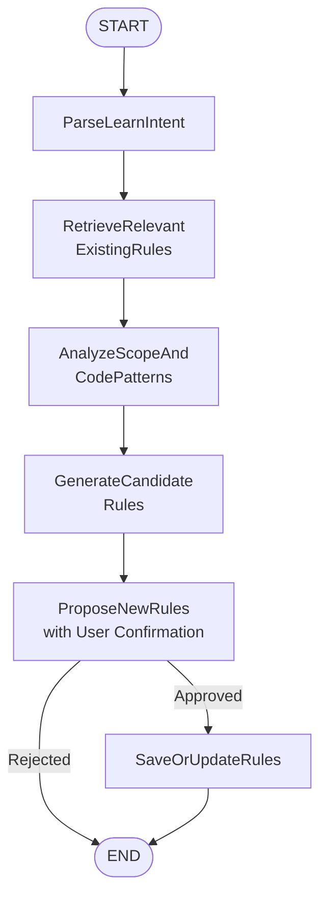

# Learning Subgraph: Implementation Specification

## 1. Subgraph State Definition

```typescript
/**
 * Complete internal state of the Learning Subgraph.
 * This state is mutated only by the nodes within the subgraph.
 */
interface LearningSubgraphState {
  // === Inputs (provided by the caller at invocation) ===
  userInput: string; // Raw learning prompt from user
  scope: string | null; // Optional scope (file path, directory, or concept domain)
  projectRoot: string; // Absolute path to the project root

  // === Parsed Intent ===
  extractedIntent: {
    candidateName: string;
    description: string;
    keywords: string[];
    triggerConditions: Record<string, string[]>; // e.g., { "fileType": ["dto"], "userIntent": ["implement_domain_model"] }
  } | null;

  // === Context Gathering ===
  relevantExistingRules: RuleRecord[]; // Rules retrieved for duplication awareness
  codePatterns: CodePattern[]; // Patterns extracted from codebase analysis

  // === Generation ===
  candidateRules: CandidateRule[]; // LLM-generated rule proposals

  // === User Interaction ===
  pendingConfirmation: {
    rules: CandidateRule[];
    similarRuleHints: string; // Informational message about existing similar rules
  } | null;
  userDecision: 'approved' | 'rejected' | null;

  // === Outputs (returned to caller) ===
  savedRules: SavedRule[]; // Successfully persisted rules
  error: string | null; // Any error that occurred during execution
}

/**
 * A pattern extracted from the codebase.
 */
interface CodePattern {
  type: string; // e.g., 'naming_convention', 'decorator_usage', 'error_handling'
  description: string;
  examples: string[]; // Snippet examples
  confidence: number; // 0.0 - 1.0
}

/**
 * A rule proposal generated by the LLM, not yet persisted.
 */
interface CandidateRule {
  name: string;
  description: DescriptionSchema; // Already structured by the LLM
  tags: string[];
  triggerCondition: Record<string, string[]>;
  contextSchema: ContextSchema;
}

/**
 * A rule that has been successfully saved to the database.
 */
interface SavedRule extends CandidateRule {
  id: number;
  version: number;
  isActive: boolean;
  createdAt: Date;
  updatedAt: Date;
}
```

---

## 2. Node Definitions

The subgraph consists of six nodes (including one optional conditional edge). Each node is a pure function that takes the current state and injected dependencies, and returns a partial state update.

### 2.1 `ParseLearnIntent`

**Purpose**: Extract structured learning intent from the raw user input using an LLM.

**Input**:

- `state.userInput`
- `state.scope`

**Output** (partial state update):

- `extractedIntent`

**Implementation Contract**:

```typescript
async function parseLearnIntent(
  state: Pick<LearningSubgraphState, 'userInput' | 'scope'>,
  deps: { llm: { complete: (prompt: string) => Promise<string> } },
): Promise<Partial<LearningSubgraphState>> {
  // Prompt LLM to produce:
  // {
  //   "candidateName": "...",
  //   "description": "...",
  //   "keywords": [...],
  //   "triggerConditions": { "fileType": ["dto"], "userIntent": ["..."] }
  // }
}
```

### 2.2 `RetrieveRelevantExistingRules`

**Purpose**: Query the rule database for existing rules that might be similar to what the user wants to learn. This is used **only for user awareness** to avoid accidental duplication.

**Input**:

- `state.extractedIntent.keywords`
- `state.projectRoot` (context, not directly used in query)

**Output**:

- `relevantExistingRules`

**Implementation Contract**:

```typescript
async function retrieveRelevantExistingRules(
  state: Pick<LearningSubgraphState, 'extractedIntent'>,
  deps: {
    ruleRepository: {
      searchByKeywords: (keywords: string[]) => Promise<RuleRecord[]>;
    };
  },
): Promise<Partial<LearningSubgraphState>> {
  const rules = await deps.ruleRepository.searchByKeywords(
    state.extractedIntent!.keywords,
  );
  return { relevantExistingRules: rules };
}
```

### 2.3 `AnalyzeScopeAndCodePatterns`

**Purpose**: Read files within the provided `scope` and extract recurring, standardizable patterns using lightweight heuristics (regex or AST parsing). This analysis is independent of existing rules.

**Input**:

- `state.scope`
- `state.projectRoot`

**Output**:

- `codePatterns`

**Implementation Contract**:

```typescript
async function analyzeScopeAndCodePatterns(
  state: Pick<LearningSubgraphState, 'scope' | 'projectRoot'>,
  deps: {
    fileSystem: {
      readFilesInScope: (scope: string, root: string) => Promise<FileContent[]>;
    };
  },
): Promise<Partial<LearningSubgraphState>> {
  const files = await deps.fileSystem.readFilesInScope(
    state.scope,
    state.projectRoot,
  );
  // Perform pattern detection (e.g., detect consistent naming, decorator usage)
  const patterns: CodePattern[] = [];
  // ...
  return { codePatterns: patterns };
}
```

### 2.4 `GenerateCandidateRules`

**Purpose**: Instruct the LLM to generate one or more candidate rules based on the extracted intent and observed code patterns. The LLM is prompted to produce a structured JSON output that conforms to the `CandidateRule` interface.

**Input**:

- `state.extractedIntent`
- `state.codePatterns`

**Output**:

- `candidateRules`

**Implementation Contract**:

```typescript
async function generateCandidateRules(
  state: Pick<LearningSubgraphState, 'extractedIntent' | 'codePatterns'>,
  deps: { llm: { complete: (prompt: string) => Promise<string> } },
): Promise<Partial<LearningSubgraphState>> {
  // Build prompt including extracted intent and pattern descriptions.
  // Expect LLM to return an array of CandidateRule objects.
}
```

### 2.5 `ProposeNewRules`

**Purpose**: Present the candidate rules to the user for approval. If similar existing rules were found, a hint is displayed. The node blocks until the user responds via the injected `promptUser` callback.

**Input**:

- `state.candidateRules`
- `state.relevantExistingRules`

**Output**:

- `pendingConfirmation`
- `userDecision`

**Implementation Contract**:

```typescript
async function proposeNewRules(
  state: Pick<
    LearningSubgraphState,
    'candidateRules' | 'relevantExistingRules'
  >,
  deps: {
    promptUser: (question: string, options?: string[]) => Promise<string>;
  },
): Promise<Partial<LearningSubgraphState>> {
  const hints = buildSimilarityHints(state.relevantExistingRules);
  const question = formatProposalQuestion(state.candidateRules, hints);
  const answer = await deps.promptUser(question, ['approve', 'reject']);
  return {
    pendingConfirmation: {
      rules: state.candidateRules,
      similarRuleHints: hints,
    },
    userDecision: answer === 'approve' ? 'approved' : 'rejected',
  };
}
```

### 2.6 `SaveOrUpdateRules`

**Purpose**: Persist the approved candidate rules to the database. This includes inserting into the `rules` table and populating the `rule_references` join table based on the `description.refs` and `context_schema` fields.

**Input**:

- `state.candidateRules`
- `state.userDecision`

**Output**:

- `savedRules`
- `error`

**Implementation Contract**:

```typescript
async function saveOrUpdateRules(
  state: Pick<LearningSubgraphState, 'candidateRules' | 'userDecision'>,
  deps: {
    ruleRepository: {
      save: (rule: CandidateRule) => Promise<SavedRule>;
      saveReferences: (
        ruleId: number,
        sourceRuleIds: number[],
      ) => Promise<void>;
    };
  },
): Promise<Partial<LearningSubgraphState>> {
  if (state.userDecision !== 'approved') {
    return { savedRules: [] };
  }
  const saved: SavedRule[] = [];
  for (const candidate of state.candidateRules) {
    const savedRule = await deps.ruleRepository.save(candidate);
    // Extract referenced rule IDs from description.refs and context_schema
    const referencedIds = extractReferencedRuleIds(candidate);
    await deps.ruleRepository.saveReferences(savedRule.id, referencedIds);
    saved.push(savedRule);
  }
  return { savedRules: saved, error: null };
}
```

---

## 3. Subgraph Flow & State Transitions

The subgraph execution follows a linear, deterministic sequence with a single branch at the user confirmation step.

| Current Node                    | Next Nodes                      | Condition                     |
| :------------------------------ | :------------------------------ | :---------------------------- |
| `ParseLearnIntent`              | `RetrieveRelevantExistingRules` | Always                        |
| `RetrieveRelevantExistingRules` | `AnalyzeScopeAndCodePatterns`   | Always                        |
| `AnalyzeScopeAndCodePatterns`   | `GenerateCandidateRules`        | Always                        |
| `GenerateCandidateRules`        | `ProposeNewRules`               | Always                        |
| `ProposeNewRules`               | `SaveOrUpdateRules`             | `userDecision === 'approved'` |
| `ProposeNewRules`               | `END`                           | `userDecision === 'rejected'` |
| `SaveOrUpdateRules`             | `END`                           | After successful persistence  |

**Diagram**:



---

## 4. Dependency Injection Interface

The subgraph must be instantiated with the following services provided by the host environment.

```typescript
interface LearningSubgraphDependencies {
  // LLM invocation
  llm: {
    /**
     * Send a prompt to the LLM and return the raw string response.
     * The subgraph is responsible for parsing JSON from the response.
     */
    complete(prompt: string): Promise<string>;
  };

  // Rule repository (database access)
  ruleRepository: {
    /** Full-text search on rule name and tags. */
    searchByKeywords(keywords: string[]): Promise<RuleRecord[]>;

    /** Insert a new rule into the `rules` table. Returns the saved record with generated ID. */
    save(rule: CandidateRule): Promise<SavedRule>;

    /** Insert entries into the `rule_references` table. */
    saveReferences(ruleId: number, sourceRuleIds: number[]): Promise<void>;
  };

  // File system access
  fileSystem: {
    /**
     * Recursively read all text files under the given scope path.
     * If scope is null, should probably return an empty array or use a default scope.
     */
    readFilesInScope(
      scope: string | null,
      projectRoot: string,
    ): Promise<FileContent[]>;
  };

  // Synchronous user interaction callback
  promptUser: (question: string, options?: string[]) => Promise<string>;
}

interface FileContent {
  path: string;
  content: string;
}
```

---

## 5. Input / Output Contract

### Invocation

```typescript
const result = await learningSubgraph.run({
  userInput: 'Learn the DDD aggregate conventions in this module',
  scope: 'src/domain/order',
  projectRoot: '/path/to/project',
  // dependencies injected at construction time
});
```

### Returned Output

```typescript
interface LearningSubgraphOutput {
  savedRules: SavedRule[];
  error: string | null;
}
```

---

## 6. Module Embedding: Using the Subgraph as a Child Graph

To keep parent graphs maintainable, the Learning Subgraph is exposed as a single **child graph node** with its own private state. A parent graph can invoke it like any other node, passing only the required inputs and receiving the output.

**Example parent graph integration**:

```typescript
// Parent graph state
interface ParentState {
  userRequest: string;
  currentFile: string;
  // ... other parent fields
}

const parentGraph = new StateGraph<ParentState>().addNode(
  'handle_learn_request',
  async (state) => {
    // Invoke the Learning Subgraph as a child module
    const subgraphOutput = await learningSubgraph.run({
      userInput: state.userRequest,
      scope: state.currentFile,
      projectRoot: state.projectRoot,
    });

    if (subgraphOutput.error) {
      return { lastError: subgraphOutput.error };
    }
    return { learnedRuleIds: subgraphOutput.savedRules.map((r) => r.id) };
  },
);
// ... rest of the parent graph
```

Because the subgraph's state is completely encapsulated, the parent does not need to manage any intermediate fields like `extractedIntent` or `candidateRules`. This prevents state explosion and enforces clean separation of concerns.

---

## 7. Error Handling Strategy

| Scenario                              | Behavior                                                                           |
| :------------------------------------ | :--------------------------------------------------------------------------------- |
| LLM call fails (timeout / rate limit) | Retry once; if still failing, set `error` field and exit.                          |
| No files found in scope               | `codePatterns` remains empty; generation proceeds based only on intent.            |
| User rejects proposal                 | Subgraph exits cleanly with `savedRules: []` and `error: null`.                    |
| Database write fails                  | Set `error` field with the database error message; no partial saves are committed. |
| Invalid LLM JSON response             | Attempt to repair; if impossible, set `error` and exit.                            |

---

## 8. Implementation Notes for MVP

1. **No Persistent Interrupts**: The subgraph uses a synchronous `promptUser` callback. Execution blocks until the user responds. If the process is terminated (Ctrl+C), the session is lost. This avoids complex state serialization for the MVP.

2. **Lightweight Pattern Detection**: Scope analysis may start with simple regex patterns (e.g., detecting `@Injectable()` or class naming conventions). A production version could integrate `ts-morph` for TypeScript AST analysis.

3. **Rule Duplication Awareness Only**: The subgraph informs the user about similar existing rules but does **not** automatically merge, refactor, or deactivate them. The user retains full control over what is saved.

4. **Structured Descriptions**: The LLM is explicitly prompted to output the `description` field in the structured format `{ text: string, refs: [...] }`. The placeholder syntax `{rule:N}` is used consistently.

5. **Base Rules (IDs ≥ 100)**: The system must be pre-populated with base rules that provide fundamental information (e.g., "Get service root directory"). These are referenced by `sourceRuleId` in `context_schema` and are executed by the agent's built-in capabilities, not by the subgraph itself.

---

## 9. Alignment with Database Schema

The subgraph's `CandidateRule` and `SavedRule` interfaces directly map to the `rules` table structure described in the appendix. When saving a rule, the `save` method of the repository is responsible for:

- Inserting the main record into the `rules` table.
- Parsing `description.refs` and `context_schema` to collect all `ruleId` values.
- Inserting corresponding entries into the `rule_references` table with the appropriate `reference_type`:
  - `'MENTIONED_IN_DESC'` for references from `description.refs`.
  - `'CONTEXT_SOURCE'` for references from `context_schema` (using the `context_key` column).
