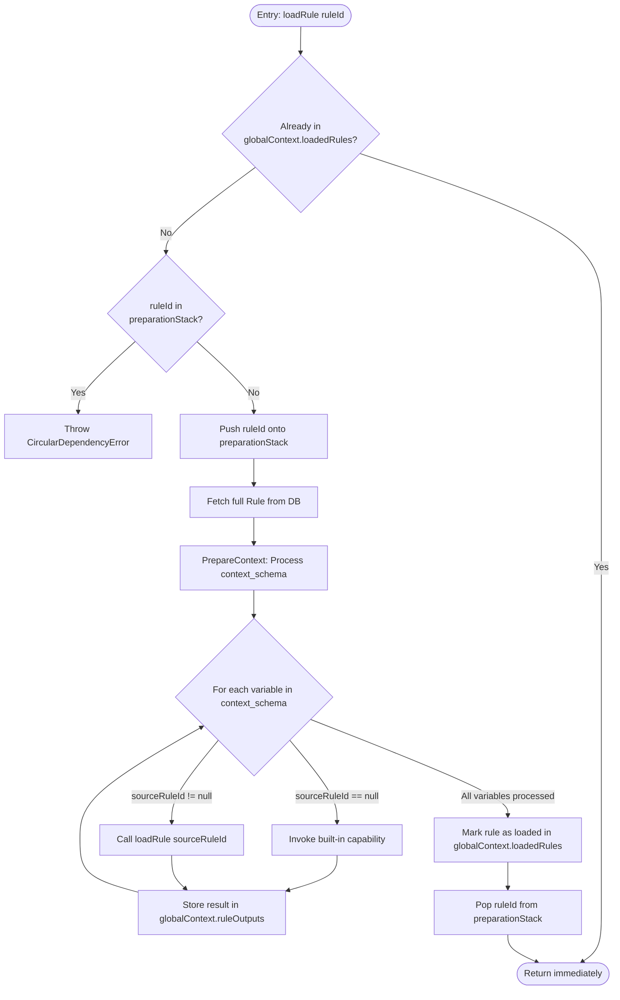

## 5. Subgraph: `LoadRequiredRule` (Self‑Contained Module)

This is the **core recursive retrieval engine**. It operates as a **separate state machine** with its own internal state, exposing only a simple interface to the main flow.

### Interface

```typescript
interface LoadRuleSubgraph {
  /**
   * Loads a single rule and recursively prepares its context.
   * @throws CircularDependencyError if a cycle is detected.
   * @returns A promise that resolves when the rule and all its dependencies are loaded.
   */
  loadRule(ruleId: number, globalContext: RuleContext): Promise<void>;
}
```

### Internal State (Encapsulated)

The subgraph maintains **its own stack** independent of the main execution stack.

```typescript
// Private to the LoadRuleSubgraph instance
interface SubgraphState {
  // Stack of rule IDs currently being prepared *within this subgraph invocation*
  preparationStack: number[];
}
```

### Detailed Subgraph Flow



### Algorithm for `prepareContext` (inside subgraph)

```typescript
private async prepareContext(rule: Rule, globalCtx: RuleContext, state: SubgraphState): Promise<void> {
  const outputsForThisRule: Record<string, any> = {};

  for (const [varName, varDef] of Object.entries(rule.contextSchema)) {
    let value: any;

    if (varDef.sourceRuleId === null) {
      // Base rule: use built-in capability (e.g., file system, AST parser)
      value = await this.executeBuiltInCapability(varDef);
    } else {
      // Recursively load dependency
      await this.loadRule(varDef.sourceRuleId, globalCtx);
      const sourceOutputs = globalCtx.ruleOutputs.get(varDef.sourceRuleId);
      if (!sourceOutputs || !(varDef.outputKey in sourceOutputs)) {
        throw new Error(`Rule ${rule.id} depends on output '${varDef.outputKey}' from rule ${varDef.sourceRuleId}, but it was not provided.`);
      }
      value = sourceOutputs[varDef.outputKey];
    }

    outputsForThisRule[varName] = value;
  }

  globalCtx.ruleOutputs.set(rule.id, outputsForThisRule);
}
```
